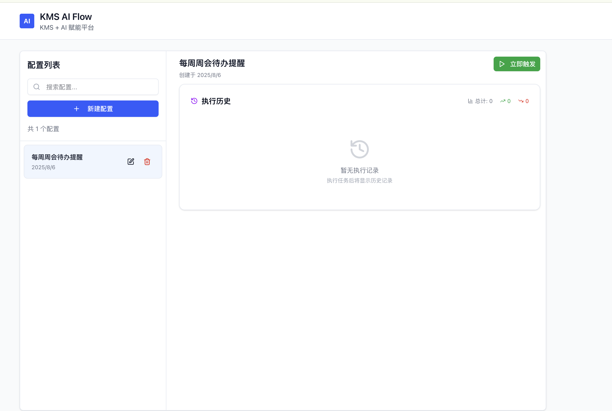

# Confluence AI Flow

一个基于 Next.js 的智能 Confluence 内容分析和通知系统，集成了 LangChain AI 框架和企业微信机器人。



## 功能特性

### 🔧 配置管理
- ✅ 支持多个配置保存到 JSON 文件
- ✅ 配置的增删改查操作
- ✅ 启动时自动从文件读取配置
- ✅ 支持配置的启用/禁用状态管理

### 📄 Confluence 集成
- ✅ 获取当前页面内容
- ✅ 获取页面的所有子页面内容
- ✅ 获取最新的子页面内容
- ✅ 支持多种 Confluence URL 格式
- ✅ 自动提取页面 ID

### 🤖 AI 分析
- ✅ 基于 LangChain 框架
- ✅ 支持 OpenAI GPT 模型
- ✅ 智能内容分析和摘要
- ✅ 提取关键信息和行动建议
- ✅ 风险识别和优先级评估

### ⏰ 定时任务
- ✅ 基于 Cron 表达式的定时执行
- ✅ 支持任务的动态添加/删除/更新
- ✅ 任务执行状态监控
- ✅ 执行记录保存

### 📢 通知系统
- ✅ 企业微信机器人通知
- ✅ Slack 通知支持
- ✅ 自定义 Webhook 通知
- ✅ 多种消息格式（Markdown、HTML、纯文本）

## 快速开始

### 1. 环境准备

```bash
# 克隆项目
git clone <repository-url>
cd ConfluenceAIFlow

# 安装依赖
npm install

# 复制环境变量配置文件
cp .env.example .env.local
```

### 2. 配置环境变量

编辑 `.env.local` 文件，填入必要的配置：

```env
# OpenAI 配置
OPENAI_API_KEY=your_openai_api_key_here
OPENAI_MODEL=gpt-3.5-turbo

# Confluence 配置
CONFLUENCE_BASE_URL=https://your-domain.atlassian.net
CONFLUENCE_USERNAME=your_email@example.com
CONFLUENCE_API_TOKEN=your_confluence_api_token

# 启用调度器
SCHEDULER_ENABLED=true
```

### 3. 启动应用

```bash
# 开发模式
npm run dev

# 生产模式
npm run build
npm start
```

访问 `http://localhost:3000` 开始使用。

## API 接口

### 配置管理 API

- `GET /api/configs` - 获取所有配置
- `POST /api/configs` - 创建新配置
- `PUT /api/configs` - 更新配置
- `DELETE /api/configs?id={id}` - 删除配置

### Confluence API

- `POST /api/confluence` - 获取 Confluence 页面内容
- `GET /api/confluence?url={url}&type={type}` - 通过查询参数获取内容

支持的页面类型：
- `current` - 当前页面
- `all_children` - 当前页面 + 所有子页面
- `latest_children` - 当前页面 + 最新子页面

### 执行 API

- `POST /api/execute` - 手动执行 AI 分析任务
- `GET /api/execute?configId={id}` - 获取执行状态

### 健康检查 API

- `GET /api/health` - 系统健康状态检查

## 使用说明

### 1. 创建配置

1. 点击「新建」按钮
2. 填写配置信息：
   - 配置名称
   - Confluence 页面 URL
   - 分析需求描述
   - 通知方式和 Webhook URL
   - Cron 表达式（定时执行）
3. 保存配置

### 2. 手动执行

在配置列表中点击「执行」按钮，可以立即执行 AI 分析任务。

### 3. 定时执行

配置了 Cron 表达式的任务会自动按计划执行，执行结果会通过配置的通知方式发送。

### 4. 查看结果

- 在配置详情页面查看最近的执行记录
- 通过企业微信或其他通知渠道接收分析结果

## Cron 表达式示例

```
# 每天上午 9 点
0 9 * * *

# 工作日上午 9 点
0 9 * * 1-5

# 每小时执行
0 * * * *

# 每 30 分钟执行
*/30 * * * *
```

## 企业微信机器人配置

1. 在企业微信群中添加机器人
2. 获取 Webhook URL
3. 在配置中选择「企业微信」通知类型
4. 填入 Webhook URL

## 技术栈

- **前端**: Next.js 15, React 19, Tailwind CSS
- **后端**: Next.js API Routes
- **AI**: LangChain, OpenAI GPT
- **定时任务**: node-cron
- **数据存储**: JSON 文件
- **UI 组件**: Radix UI, Lucide Icons

## 项目结构

```
├── app/
│   ├── api/           # API 路由
│   │   ├── configs/    # 配置管理 API
│   │   ├── confluence/ # Confluence API
│   │   ├── execute/    # 执行 API
│   │   └── health/     # 健康检查 API
│   ├── globals.css     # 全局样式
│   ├── layout.js       # 根布局
│   └── page.js         # 主页面
├── components/         # React 组件
├── lib/               # 核心服务
│   ├── aiService.js       # AI 分析服务
│   ├── configService.js   # 配置管理服务
│   ├── confluenceService.js # Confluence 服务
│   ├── notificationService.js # 通知服务
│   ├── schedulerService.js # 调度服务
│   └── startup.js         # 启动脚本
└── data/              # 数据文件
    ├── configs.json       # 配置数据
    └── execution_records.json # 执行记录
```

## 开发指南

### 添加新的通知类型

1. 在 `lib/notificationService.js` 中添加新的格式化方法
2. 在 `sendNotification` 方法中添加新的 case
3. 更新前端的通知类型选项

### 扩展 AI 分析功能

1. 修改 `lib/aiService.js` 中的系统提示模板
2. 调整分析结果的数据结构
3. 更新通知格式化逻辑

### 添加新的页面类型

1. 在 `lib/confluenceService.js` 中添加新的获取方法
2. 在 `getContentByType` 方法中添加新的 case
3. 更新前端的页面类型选项

## 故障排除

### 常见问题

1. **配置无法保存**
   - 检查 `data` 目录是否存在且有写入权限
   - 确认 `CONFIG_FILE_PATH` 环境变量配置正确

2. **Confluence 连接失败**
   - 验证 Confluence URL、用户名和 API Token
   - 确认网络连接正常
   - 检查 Confluence 权限设置

3. **AI 分析失败**
   - 验证 OpenAI API Key 是否正确
   - 检查网络连接和 API 配额
   - 确认模型名称配置正确

4. **定时任务不执行**
   - 确认 `SCHEDULER_ENABLED=true`
   - 检查 Cron 表达式格式
   - 查看控制台日志

5. **通知发送失败**
   - 验证 Webhook URL 是否正确
   - 检查网络连接
   - 确认机器人权限设置

## 许可证

MIT License